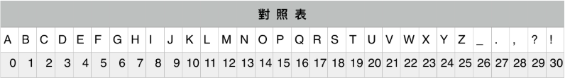

# Homework 2: Hill Cipher

## Purpose:

本次作業透過 Hill Cipher 來了解矩陣相乘和反矩陣的計算方式。

首先 Hill Cipher 概念就是，有一組密碼 plain_text，你不希望這組密碼被發現時就直接可以被利用，所以透過加密的方式表示，其中這指的加密方式就是線性轉換，而線性轉換就是矩陣相乘，我們稱這矩陣為 key，被加密過後的密碼稱為 cipher_text。

接下來用數學來表達上述的過程，針對密碼所包含的符號和字母，必須轉換成數字才有法用電腦運算，如下對照表。

有了上述的對照表，可以將密碼 plain_text 透過對照表的方式轉成矩陣，稱為矩陣 P，線性轉換的 key 稱為矩陣 K，加密過後的密碼稱為矩陣 C，而加密過後的還原稱為 cipher_text。表示如下:

另外在這份作業裡面，矩陣 K 均為 3x3。細節請參考 Reference 的連結。

## Summary

- Problem 1:  
主要是給與 cipher_text 和 key，進而求得 plain_text

- Problem 2:  
主要是給與 cipher_text 和 plain_text，進而求得 key

## Reference

- [原始課程作業說明](https://docs.google.com/presentation/d/1Tq9ReVH_NkEYcOb5Idevc8GNw9fJQOLjEm0VZf09weE/edit#slide=id.g433e108233_0_15)

- [李宏毅老師的說明影片](https://www.youtube.com/watch?v=G_dATE22UqY&fbclid=IwAR22_ypSuzJTf6L_trnMiDHenNjIx9_Wo-FaeM0lyUr0GMx_suhWjSJlNJc)

- [現代啟示錄：Hill Cipher](https://ccjou.wordpress.com/2013/09/10/%E5%B8%8C%E7%88%BE%E5%AF%86%E7%A2%BC/?fbclid=IwAR175SK34eqCXJfhOsDnlk_0cEQ4bLSDG1BSSsd36JQSMaq436LxlpJoIok)