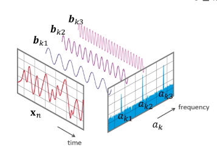
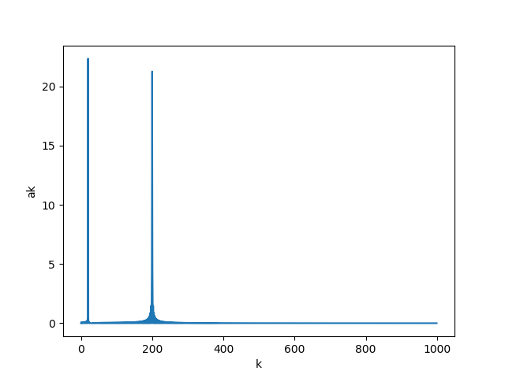
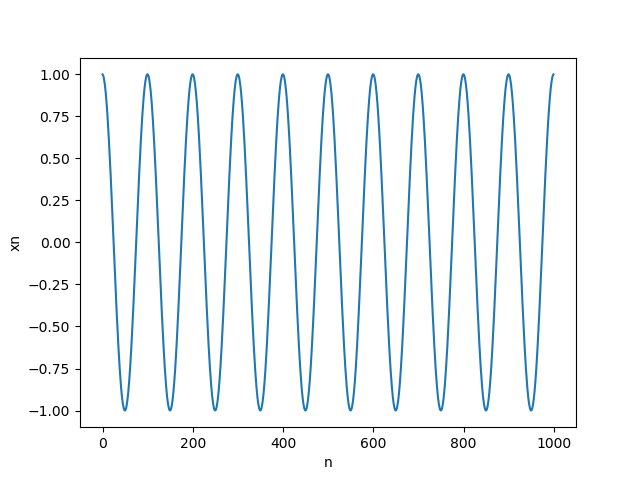
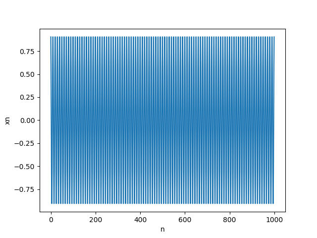
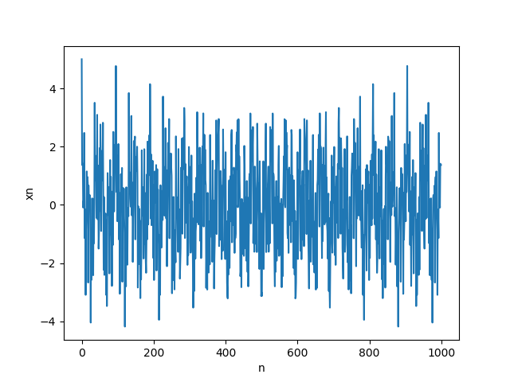
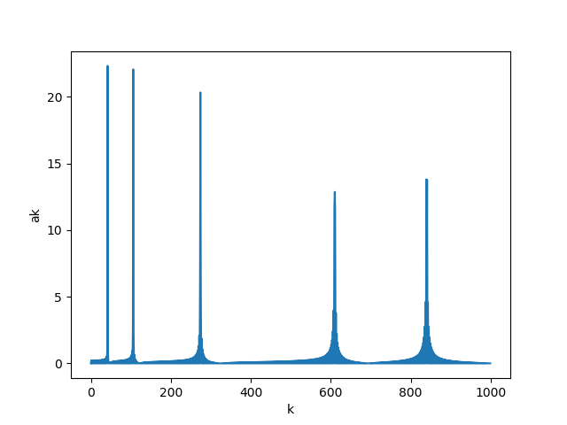
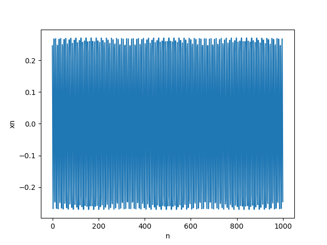

# Homework 3: Cosine Transform

## Purpose:

本次作業透過 Cosine Transform 來了解 basis 以及 Coordinate System 的概念及應用。

在直角座標系統中，任何座標 (x, y) 可以用 e1=(1, 0) 和 e2=(0, 1) 向量來表示，而這個 e1, e2 就是所謂的 basis，數學式如下所示:

簡單來說，座標 (2, 3) 可以理解成在 x 軸方向的強度為 2, y 軸方向的強度為 3。也就是說直角坐標上面任何一個點都可以用 e1 和 e2 組合出來。

在這次作業中，有一筆訊號資料，我們希望透過很多個 cosine 波行來描述原本的訊號，而每個 cosine 波行都會有其相對的強度，或稱頻率。這個部分可以將 cosine 波行理解成 basis，頻率就是波型的強度。如下圖所示:

這樣做的好處就是原本的訊號可能很複雜無法進行分析，但 cosine 波行相對簡單比較好分析甚至是應用。

## Summary

這次作業我們對兩個訊號進行 cosine Transform:

1. 針對課程說明的訊號資料:  

    左下圖為原始訊號，右下圖為遠使訊號經過 1000 個 cosine 波行分解後，每個波行對應到的強度 (頻率)，其中兩個波平率特別強，分別是第 20 個和第 200 個

    <figure class="half">
        
        
    </figure>  

    左下圖為第 20 個 cosine 波的圖形，右下圖為第 200 個 cosine 波的圖形

    <figure class="half">
        
        
    </figure>

2. 針對每個人的訊號資料:

    由於是看網路課程，所以隨便下載一份檔案實作 r06944045.txt，下載連結 Reference 有提供 

    左下圖為原始訊號，右下圖為遠使訊號經過 1000 個 cosine 波行分解後，每個波行對應到的強度 (頻率)，其中五個波平率特別強

    <figure class="half">
        
        
    </figure>

    根據作業要求將第一個和第三個特別強的波行畫出來，左下圖為第 1 個 cosine 波的圖形，右下圖為第 3 個 cosine 波的圖形

    <figure class="half">
        
        
    </figure>

## Reference

- [原始課程作業說明](https://docs.google.com/presentation/d/1FWdGiWaBf_toaUA5jL4OOuRUYeVfbR0QcL6o-0xjJmE/edit?fbclid=IwAR3VRWPqKtK_-Cp6tTwh77ZH4-APeGeqqjOaMifyf23gkpm-q0Q1XZGrISo#slide=id.p1)

- [原始程式和檔案](https://www.space.ntu.edu.tw/navigate/s/389F655963054F1DA6BB2E5D19392540QQY)