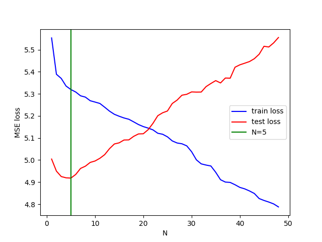
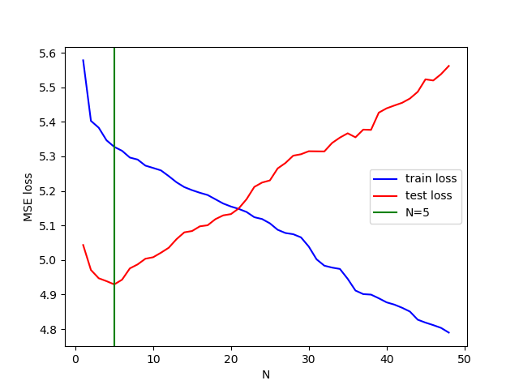

# Homework 5: Linear Regression For PM2.5 Prediction

## Purpose:

本次作業是新望透過一個簡單的回歸預測題目來了解線性代數的應用

## Summary

- Question 1  
  
  我們都知道基本的線性回歸，資料 , 參數 , 預測值 ，即可得預測的 。我們希望  跟真實的  越接近越好。  

  站在線性代數的角度可以理解成把資料  做線性組合，每個特徵的權重 ，希望可以在 span  的空間中找到一組  使得  越接近  越好。而這個  的最佳解就會是  投影到 span  上面。由課堂上我們可以知道 ，根據這個式子跟線性回歸的式子可以得知 。

- Question 2  
  
  如下圖，根據 N = 1~48 的 training loss 和 testing loss 作圖，可以發現隨著 N 越來越大 train loss 越來越好，而 testing loss 則是先下降再上升。另外也可以藉由這張圖來決定 N 要選擇多少比較適合來做預測。

  

- Question 3  

  在 [機器學習的HW1](https://github.com/machineCYC/2017MLSpring_Hung-yi-Lee/tree/master/HW1) 我們有去試著比較利用公式算出權重和用 gradient descent 甚至是 Adagrade 的方式計算的差異。
  
  嘗試理解 numpy 的 matrix inverse，可以得知是利用 LU 分解將矩陣拆解成上山角和下山腳矩陣成積來找反矩陣。

  而針對特徵的選取，其實最簡單的方式可以嘗試一次將一個特徵剔除，並對模型計算 MSE 來看哪個特徵比較重要。

  另外針對 Question 2，我們將模型的截距項拿掉來做一次同樣的事情，發現差異不是太明顯。
  
  

## Reference

- [原始課程作業說明](https://drive.google.com/file/d/1NRMQInCh8kPKj9P6qsTINHCHaYolIihZ/view?fbclid=IwAR0GJGMKiMkWNJFQxYauZfnwedY7gNDScOz0K6wSQ6j13SJhi8AUUpofK2o)

- [How does numpy.linalg.inv calculate the inverse of an orthogonal matrix?](https://stackoverflow.com/questions/16569613/how-does-numpy-linalg-inv-calculate-the-inverse-of-an-orthogonal-matrix)