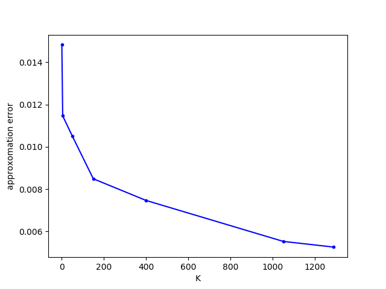
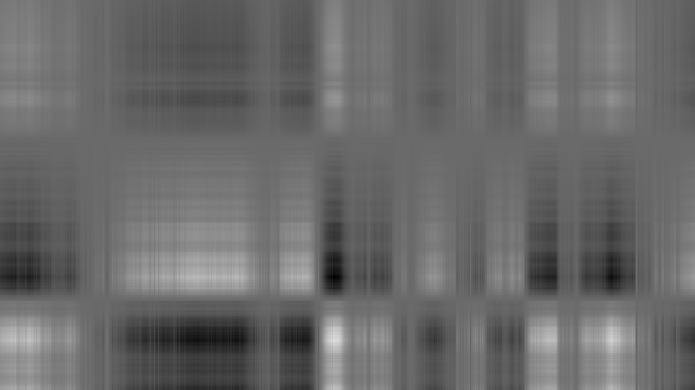
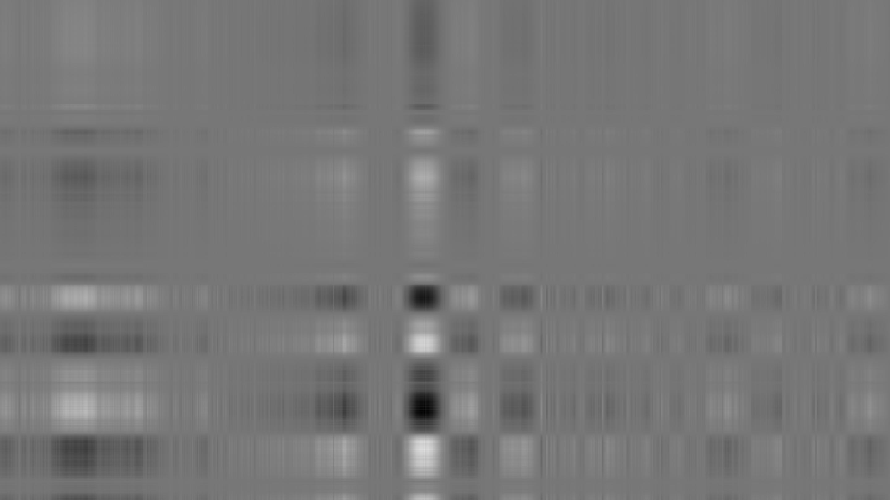
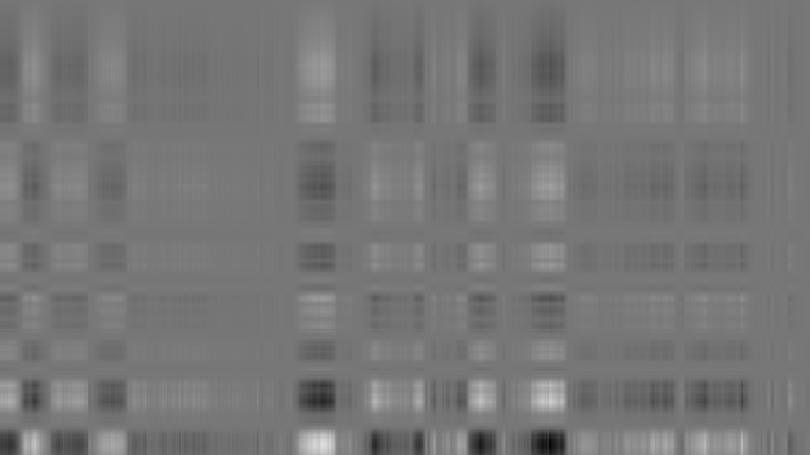

# Homework 6: Singular Value Decomposition

## Purpose:

這次作業是希望透過 SVD 來實現照片的壓縮，藉此來了解 SVD 的應用

## Summary

- Question 1 : A plot includes curve describing the relation of k and approximation error  

  下圖為隨機從網路上下載的照片，並對這張照片的每個 channel 進行 SVD 的操作。

  <figure class="half">
      
  </figure>  

  根據不同的 k 來對照片進行 SVD，並觀察經過壓縮過後的照片根源圖之間的差異，如下圖，很清楚的可以發現，隨著 k 越來越大，error 也越來越小。

  <figure class="half">
      
  </figure>  

  由壓縮過後的照片，可以得知，k 越小，還原出來的照片只會有輪廓，隨著 k 越來越大，細節的部分會越清楚，如下由上至下，左至右，k 依序為 1, 5, 50, 150, 400, 1050, 1289

  <figure class="half">
      
      
      
  </figure>  

- Question 2 : Analyze the rank of R channel of the provided image and explain how you analyze.  

  透過兩個方式來計算 R channel 的 rank
  - numpy 中的 numpy.linalg.matrix_rank，其中也是透過 SVD 的方式算 rank  
  - 另一個方式是夠過線性代數的理論得知，照片中 R channel 相當於一個矩陣，稱為 A，我們對 A 矩陣進行 SVD 分解，可以得到 ，其中  為一個對角線部分不為 0，非對角線均為 0 的矩陣，而對角線不為 0 的個數為該矩陣的 rank，又因為 rank(AB) <= min(rank(A), rank(B))，所以 rank(A) 就會等於  對角線不為 0 的個數

- Question 3 : Plots in doc page 6 but on G channel.  
  
  這個部份針對圖片 G channel 進行 SVD，並對  對角線中前 5 個　　**個別**還原圖片，如下圖：

    

  如下圖，由上至下，左至右分別為對角線第一個　　，第二個  ...，最後一張為前5個  所還原的照片。

  <figure class="half">
      
      
  </figure>  

由上述這些操作可以知道，用單一一個  所還原的照片是非常不清楚的，但也不用用全部的  就可以還原出非常接近原圖的照片，因此就可以做到圖片壓縮。

## Reference

- [原始課程作業說明](https://drive.google.com/file/d/1nJTnZWUXystt_GLBlcdjIcqjsMGTicdz/view?fbclid=IwAR2X-o_JTXNZpV2jIuWlcPPorwUZbWmYBMjPd1sn4Zrm_qCksBCM8PssMTA)
